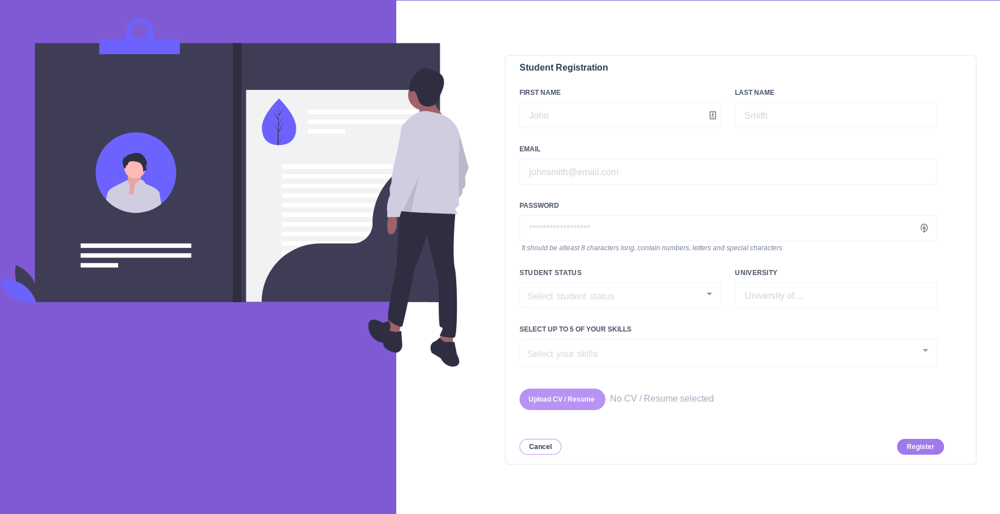
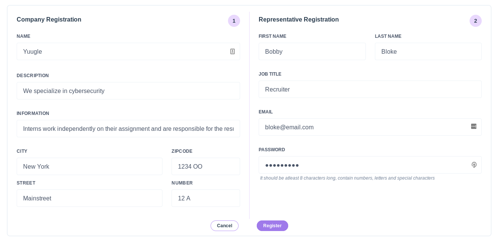
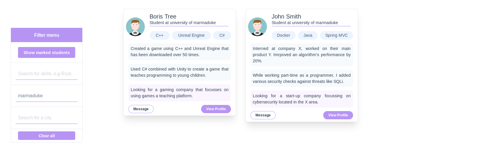
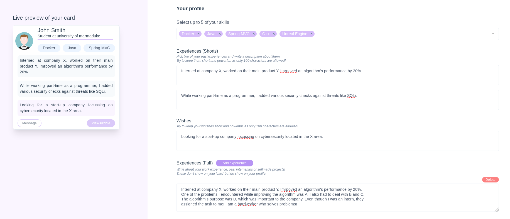
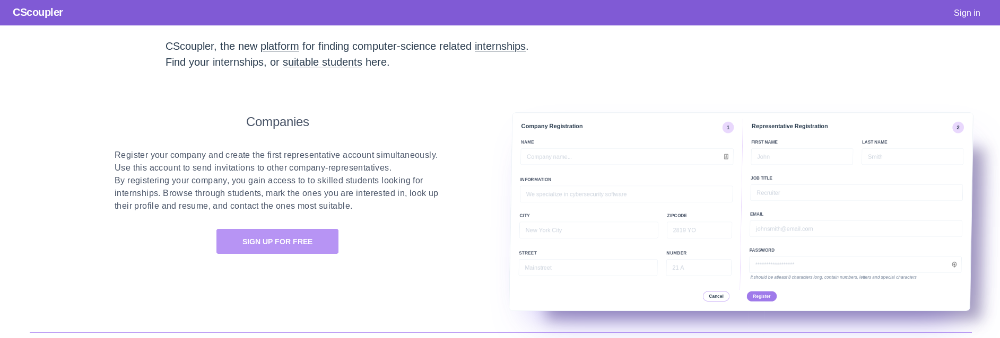
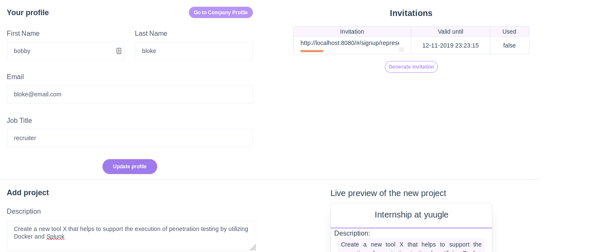
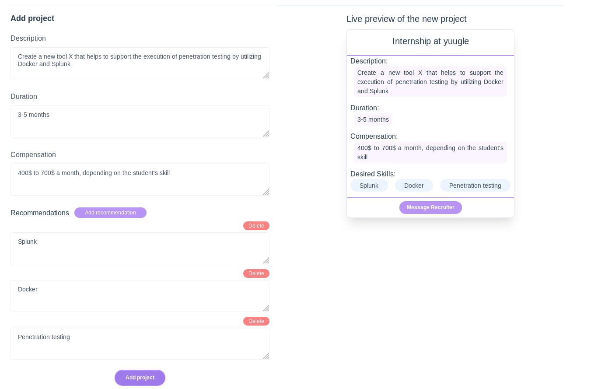

## CScoupler

A platform for companies and students to come in touch with one another, easing the internship hunt for students and easing the quest of finding qualified students for companies.

---

### Docker (how to run it locally)
To run the application locally, follow the following steps:
Prerequisites: git, docker, docker-compose
1. ```git clone --recurse-submodules git@github.com:JanAbe/cscoupler.git```
2. ```cd cscoupler```
3. ```touch .secret.json```
4. ```vim .secret.json```
5. Add the following to the file: 
``` 
{
    "jwtsecret": "[your-secret]",
    "dsn": "host=db port=5432 user=postgres password=secret dbname=cscoupler sslmode=disable"
} 
```
6. Save and close the file
7. Type ```docker-compose up``` in the terminal
8. Navigate to http://localhost:8080

### Architecture

#### Frontend
The frontend has been made using Vue.js and various tools
such as vue-cli, vue-router and tailwind.css

This client consumes all the endpoints that the backend app exposes
and acts as a userfriendly way to interact with the system.

The webapp is viewable on both large, medium and small screens and is (hopefully) intuitive to use.

#### Backend
The backend code-base follows the hexagonal architecture.

The handlers package corresponds to the adapters part of the hexagonal architecture.
In this package code transforms incoming data / requests to a format that is understood by the services package.

The services package corresponds to the application part of the hexagonal architecture.
This package contains all the use cases that the application supports + some helper methods.

The domain package corresponds to the domain part of the hexagonal architecture.
In this package all the domain objects are defined aswell as the business rules.

#### Database
PostgreSQL is used to persist/store all data.

### Images

Student registration page


---

Company registration page


---

View all registered students, mark the ones you're interested in
or filter based on skills, university or city of residence.


---

Student profile page. Keep your skills, wishes and experiences
up to date, to increase finding a great internship.


---

Home page (not the whole page)


---

Representative profile page. Update your data, create
invitation to sent to your colleagues, and create new
projects for which your are searching interns.


---

